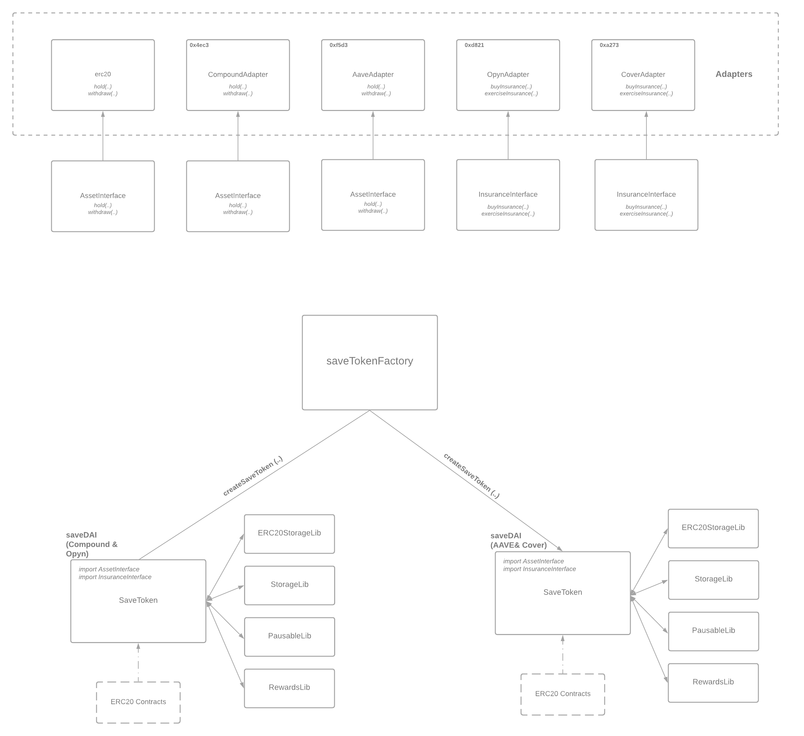

# Getting Started

## Introduction

The following documentation describes the fundamentals of the protocol and how to interact with it. Please join the [community Discord server](https://discord.gg/kBempxZr); our team and members of the community look forward to helping you build on top of SaveToken!

## How does it work?

The SaveToken protocol makes it easy to wrap any interest-bearing token with any corresponding insurance token. This enables SaveToken hodlers to generate yield while at the same time protecting their underlying assets.

For instance, a user may wish to use [Aave's](https://aave.com/) lending and borrowing protocol to generate yield via aTokens while at the same time insuring those aTokens via a corresponding insurance protocol like [Cover](https://www.coverprotocol.com/). 

To do this, the user would choose to mint SaveTokens with an ERC-20 stablecoin like DAI. The SaveToken protocol will then wrap the DAI with aDAI from Aave and CLAIM tokens from Cover, thus generating an insured, interest-bearing savings account.

Ergo, the example above:

| SaveToken | Underlying Asset | Underlying Protected | Cover Protection |
| :--- | :--- | :--- | :--- |
| SaveDAI | DAI | aDAI | CLAIM |

## Architecture

The protocol is implemented as a set of **smart contracts** on top of the Ethereum blockchain.

**Note that the SaveToken protocol cannot protect your savings against all risks, and there will always be risks in finance, especially systems that are new.**

## Resources

* [Website](https://savedai.xyz/)
* [Github](https://github.com/save-dai)
* [Twitter](https://twitter.com/save_dai)
* [Medium](https://medium.com/savedai)
* Quantstamp Audit Report \(TBD\)

