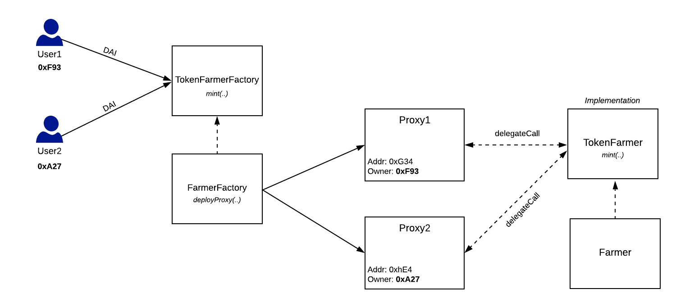

# Rewards Farmer

To enable users to receive the rewards or governance tokens they yield while their asset tokens are wrapped, we use a factory architecture pattern. The FarmerFactory generates proxies \(or Farmers\) for each user if a particular asset token protocol offers rewards or governance tokens \(e.g., `COMP`\). 

Every time users mint SaveTokens, the asset tokens are obtained from the asset token protocol via an asset adapter, and then stored in the Farmer. The asset tokens are stored in the Farmer where they yield rewards or governance tokens on behalf of the users. Therefore, even though users have their asset tokens wrapped in their SaveTokens, they can still yield rewards or governance tokens from them.

### FarmerFactory

The FarmerFactory contract is used to deploy farmer proxy contracts that store interest bearing assets and yield rewards or governance tokens on behalf of savers. 

### ProxyFactory

The ProxyFactory contract is a base [OpenZeppelin](https://github.com/OpenZeppelin/openzeppelin-sdk/blob/master/packages/lib/contracts/upgradeability/ProxyFactory.sol) factory contract used to create and deploy farmer proxies. The FarmerFactory contract inherits from ProxyFactory and generates new proxy contracts by pointing to the Farmer's logic contract address.

### Farmer

The Farmer contract is used to store interest bearing assets and yield rewards or governance tokens on behalf of savers. Asset adapters that support protocols that offer rewards or governance tokens must have their own custom Farmers \(e.g., `COMPFarmer`\).

### COMPFarmer

The COMPFarmer contract is an example custom Farmer contract built to support Compound's lending protocol. It enables users who have SaveTokens that use Compound's interest-bearing `cTokens` to still yield the `COMP` governance token even though their interest-bearing `cTokens` are wrapped in their SaveTokens.

